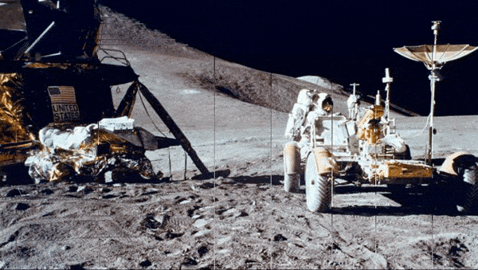
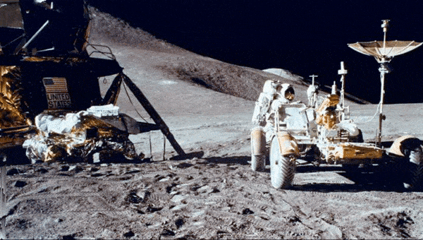
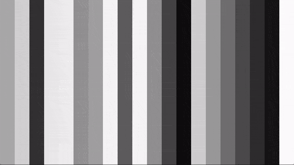
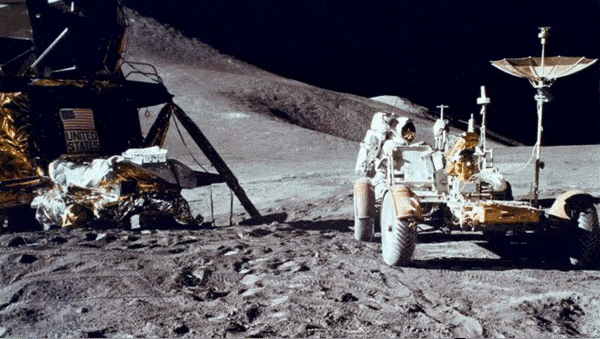

# visualizations

Here are a variety of visualization techniques we're playing around with!

### Crosshatch Glitch

### Glitch Line

### Image Dust

### Pointillism

### Bands

### Glitch Jitter Strips

### Image Pixel Bands

### Image Square Dust

